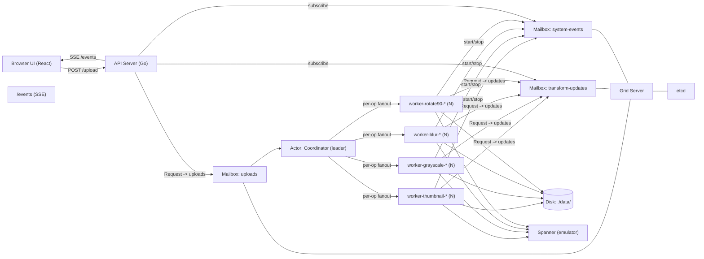

# Distributed Image Factory

A distributed image processing demo built with Go and [lytics/grid](https://github.com/lytics/grid), featuring per‑op horizontal scaling, mailbox-based coordination, real‑time UI updates (SSE), and optional Cloud Spanner storage (emulator supported).

## Features
- Upload image once → generate multiple variants (thumbnail, grayscale, blur, rotate90)
- Actor model with Grid: Coordinator + per‑op Workers
- Many workers per op on a single peer (unique per‑instance mailboxes)
- Real‑time UI via Server‑Sent Events (SSE)
- Optional Spanner emulator for storing originals/variants

## Architecture



## Requirements
- Go 1.22+
- Node 18+
- Docker (optional, for compose & Spanner emulator)
- etcd (local or via compose)

## Quick start
### Option A: Local binaries
1) Start etcd
```
etcd --listen-client-urls http://127.0.0.1:2379 --advertise-client-urls http://127.0.0.1:2379
```
2) Backend
```
export ETCD_ENDPOINT=localhost:2379
export GRID_BIND=127.0.0.1:9100
# optional emulator
# export SPANNER_DSN=projects/demo/instances/test/databases/imagefactory
# export SPANNER_EMULATOR_HOST=localhost:9010
# one worker per op on boot (optional)
# export AUTO_START_LOCAL_WORKERS=1

go run ./cmd/server
```
3) Frontend
```
cd web
npm install
npm run dev
```
Open http://localhost:5173

### Option B: Docker Compose
```
docker compose up --build
```
- API: http://localhost:8080
- UI dev: run separately: `cd web && npm run dev`

## Configuration
- `ETCD_ENDPOINT` (default `localhost:2379`)
- `GRID_BIND` (default `127.0.0.1:9100`)
- `SPANNER_DSN`, `SPANNER_EMULATOR_HOST` (optional)
- `AUTO_START_LOCAL_WORKERS` (`true/1` to auto-start one worker per op)

## API
- `POST /upload` → `{ image_id }`
- `GET /images` → `{ [image_id]: { [op]: url } }`
- `GET /images/{id}/{op}` → variant bytes
- `POST /admin/scale { op, n }` → start N workers for op
- `GET /metrics/json` → totals + per-op metrics
- `GET /metrics` → Prometheus
- `GET /events` → SSE snapshot (variants + metrics)

## How it works
- API saves original, sends `{ image_id, path }` to `uploads` mailbox.
- Coordinator acks and, per op, discovers worker instance mailboxes via etcd prefix `/ns/workers/<op>/` and broadcasts tasks.
- Workers (unique mailbox `worker-<op>-<actorName>`) transform, save results, push to `transform-updates`, and emit lifecycle to `system-events`.
- API subscribes to updates/events and streams a single snapshot to the UI via SSE.

## Development notes
- Messages use `structpb.Struct`; registered once with `grid.Register(structpb.Struct{})`.
- Always `server.WaitUntilStarted` before mailbox ops.
- Workers use background context for update pushes to avoid cancellation.

## Troubleshooting
- `codec: unregistered message type` → ensure structpb registration imports in both server and API.
- `mailbox already registered` → per-instance mailbox naming avoids collisions; extra workers exit gracefully.
- `registry: unspecified net address ip` → bind to a concrete IP (not 0.0.0.0).
- Dev 404 on `/metrics/json` → restart Vite; UI falls back to backend URL.

## License
MIT

